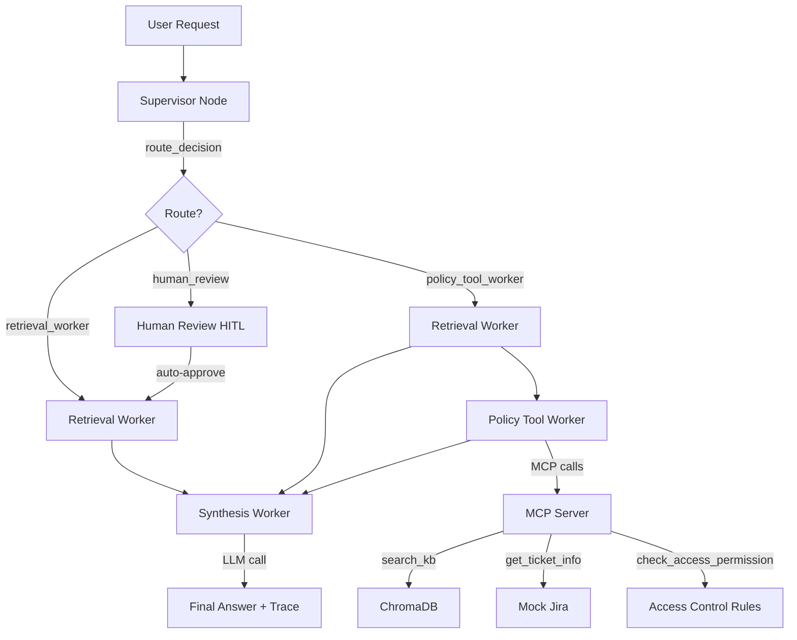

# System Architecture — Lab Day 09

**Nhóm:** 15
**Ngày:** 2026-04-14  
**Version:** 1.0

---

## 1. Tổng quan kiến trúc

> Hệ thống Multi-Agent Orchestration cho trợ lý nội bộ CS + IT Helpdesk.

**Pattern đã chọn:** Supervisor-Worker  
**Lý do chọn pattern này (thay vì single agent):**

Trong Day 08, RAG pipeline là monolith — retrieve + generate trong một hàm duy nhất. Khi pipeline trả lời sai, không thể xác định lỗi nằm ở retrieval, policy check, hay generation. Supervisor-Worker pattern tách rõ trách nhiệm: Supervisor chỉ quyết định routing, mỗi Worker chỉ xử lý một loại skill, giúp test độc lập từng phần và debug nhanh hơn qua trace log.

---

## 2. Sơ đồ Pipeline



**Sơ đồ thực tế của nhóm (ASCII art):**

```
User Request
     │
     ▼
┌──────────────────┐
│   Supervisor     │  ← route_reason, risk_high, needs_tool
│   (graph.py)     │
└────────┬─────────┘
         │
    [route_decision]
         │
    ┌────┴────────────────────────┐
    │                             │
    ▼                             ▼
retrieval_worker          policy_tool_worker
  (ChromaDB search)         │
    │                   ┌────┴────┐
    │                   │         │
    │              retrieval   policy_check
    │                   │      + MCP tools
    │                   │    (search_kb,
    │                   │     get_ticket_info,
    │                   │     check_access_permission)
    │                   │         │
    └───────┬───────────┘─────────┘
            │
            ▼
      Synthesis Worker
        (LLM / fallback)
            │
            ▼
    Final Answer + Trace
```

---

## 3. Vai trò từng thành phần

### Supervisor (`graph.py`)

| Thuộc tính | Mô tả |
|-----------|-------|
| **Nhiệm vụ** | Phân tích task bằng keyword matching, quyết định route sang worker phù hợp |
| **Input** | `task` (câu hỏi từ user) |
| **Output** | supervisor_route, route_reason, risk_high, needs_tool |
| **Routing logic** | Keyword-based: policy/refund → policy_tool_worker, SLA/ticket → retrieval_worker, access → policy_tool_worker, multi-hop detection khi có cả SLA + access keywords |
| **HITL condition** | `risk_high=True` AND chứa mã lỗi không rõ (ERR-xxx pattern) |

### Retrieval Worker (`workers/retrieval.py`)

| Thuộc tính | Mô tả |
|-----------|-------|
| **Nhiệm vụ** | Embed query → query ChromaDB → trả về top-k chunks có relevance score |
| **Embedding model** | all-MiniLM-L6-v2 (sentence-transformers, 384 dimensions) |
| **Top-k** | 3 (default) |
| **Stateless?** | Yes — chỉ đọc task từ state, ghi retrieved_chunks + retrieved_sources |

### Policy Tool Worker (`workers/policy_tool.py`)

| Thuộc tính | Mô tả |
|-----------|-------|
| **Nhiệm vụ** | Phân tích policy áp dụng, detect exceptions (Flash Sale, digital product, activated), gọi MCP tools khi cần |
| **MCP tools gọi** | `search_kb`, `get_ticket_info`, `check_access_permission` |
| **Exception cases xử lý** | flash_sale_exception, digital_product_exception, activated_exception, temporal_scoping (đơn trước 01/02/2026) |

### Synthesis Worker (`workers/synthesis.py`)

| Thuộc tính | Mô tả |
|-----------|-------|
| **LLM model** | gpt-4o-mini (OpenAI) / gemini-1.5-flash (Google) / context-based fallback |
| **Temperature** | 0.1 (low — grounded) |
| **Grounding strategy** | System prompt yêu cầu CHỈ dùng context, trích dẫn nguồn [tên_file] |
| **Abstain condition** | Khi retrieved_chunks rỗng hoặc context không chứa thông tin → trả "Không đủ thông tin trong tài liệu nội bộ" |

### MCP Server (`mcp_server.py`)

| Tool | Input | Output |
|------|-------|--------|
| search_kb | query, top_k | chunks, sources, total_found |
| get_ticket_info | ticket_id | ticket details (priority, status, assignee, SLA deadline, notifications) |
| check_access_permission | access_level, requester_role, is_emergency | can_grant, required_approvers, emergency_override, notes |
| create_ticket | priority, title, description | ticket_id, url, created_at |

---

## 4. Shared State Schema

| Field | Type | Mô tả | Ai đọc/ghi |
|-------|------|-------|-----------| 
| task | str | Câu hỏi đầu vào | supervisor đọc |
| supervisor_route | str | Worker được chọn | supervisor ghi |
| route_reason | str | Lý do route (chi tiết keywords matched) | supervisor ghi |
| risk_high | bool | True nếu task có risk keywords | supervisor ghi |
| needs_tool | bool | True nếu cần gọi MCP tools | supervisor ghi |
| hitl_triggered | bool | True nếu human review đã xảy ra | human_review ghi |
| retrieved_chunks | list | Evidence chunks từ ChromaDB | retrieval ghi, synthesis đọc |
| retrieved_sources | list | Unique source filenames | retrieval ghi |
| policy_result | dict | Kết quả policy check + access check | policy_tool ghi, synthesis đọc |
| mcp_tools_used | list | Danh sách MCP tool calls đã thực hiện | policy_tool ghi |
| final_answer | str | Câu trả lời cuối có citation | synthesis ghi |
| confidence | float | Mức tin cậy (0.0 - 1.0), estimated từ chunk scores | synthesis ghi |
| workers_called | list | Sequence các workers đã gọi | mỗi worker append |
| history | list | Full trace log | tất cả nodes ghi |
| latency_ms | int | Thời gian xử lý tổng | graph ghi |
| run_id | str | ID unique cho mỗi run | graph ghi |

---

## 5. Lý do chọn Supervisor-Worker so với Single Agent (Day 08)

| Tiêu chí | Single Agent (Day 08) | Supervisor-Worker (Day 09) |
|----------|----------------------|--------------------------|
| Debug khi sai | Khó — không rõ lỗi ở đâu | Dễ hơn — test từng worker độc lập |
| Thêm capability mới | Phải sửa toàn prompt | Thêm MCP tool + route rule |
| Routing visibility | Không có | Có route_reason trong trace cho mỗi câu |
| Multi-hop reasoning | Dùng 1 prompt duy nhất | Gọi nhiều workers + cross-reference kết quả |
| Latency | 1 LLM call (~2s) | 2-3 worker calls (~4.5s) nhưng trace rõ hơn |

**Nhóm điền thêm quan sát từ thực tế lab:**

Multi-agent pattern thực sự hữu ích nhất ở câu multi-hop (q13, q15) — khi cần cross-reference SLA + Access Control. Supervisor detect được multi-hop qua keyword overlap và gọi cả retrieval + policy + MCP check_access_permission. Với single agent, không thể biết pipeline đã dùng info từ tài liệu nào.

---

## 6. Giới hạn và điểm cần cải tiến

1. **Routing chỉ dùng keyword matching** — không detect được các câu hỏi phức tạp không chứa keyword rõ ràng. Có thể upgrade lên LLM classifier nhưng sẽ tăng latency.
2. **Confidence score chỉ dựa vào chunk similarity score** — chưa dùng LLM-as-Judge để đánh giá chất lượng answer. Hard-coded formula có thể không chính xác.